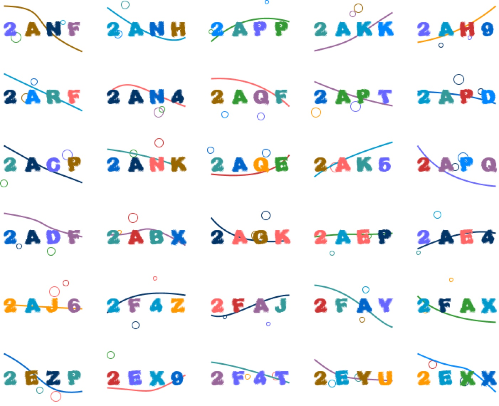
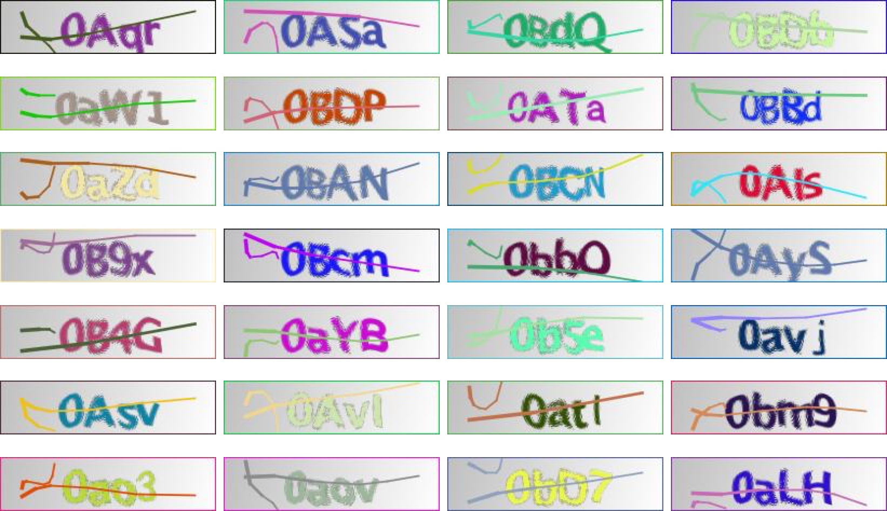
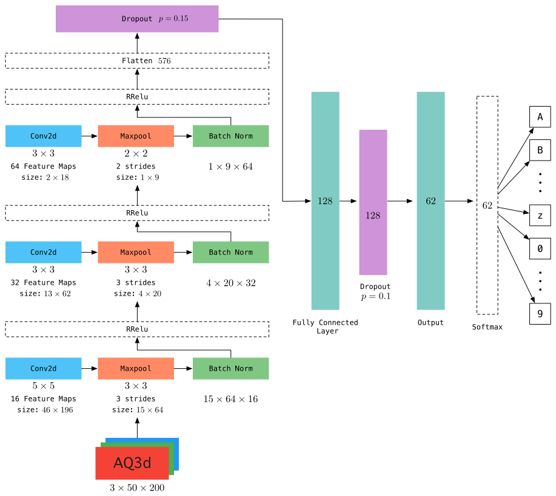
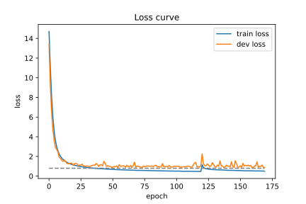
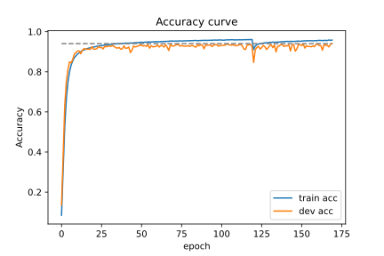
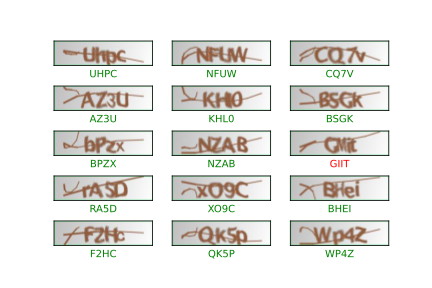

# CNN验证码识别


### 依赖环境

* Python 3.6
* click 7.1.1
* PyTorch 1.4.0
* torchvision 0.1.6.dev0
* tqdm 4.45.0
* Scikit-learn 0.22.2.post1
* Pillow 7.1.1
* matploblib 3.2.1

详细使用方法，请见下节**开始使用**。

## 开始使用

若要生成训练验证码图片，请使用`captcha-images-1.0.jar`，其使用方式如下：

```shell
usage: java -jar [jarfile].jar
 -c <text_color>        The text color of the captcha, if not specified,
                        use randomly, should be <R>,<G>,<B>
 -e <noise_same_text>   If the noise color is the same with the text
                        color, should be true or false, default false.
 -h                     Show help
 -k <kinds>             The kinds of captchas, integer, default 1
 -l <length>            The length of characters in the captchas, integer,
                        default 4
 -m <mode>              The mode of captcha, could be [easycaptcha] or
                        [kaptcha]
 -n <noise_color>       The noise color of the captcha, if not specified,
                        use randomly, should be <R>,<G>,<B>
 -o <output_dir>        The output directory of captchas, string
 -p <pool_size>         Thread pool size, integer, default 20
 -s <size>              The size of the capthcas, should be:
                        <width>,<height>
 -t <count>             The count to produce, integer, default 5,000
 -v <height>            The height of the capthcas, integer, default 80
 -w <width>             The width of the capthcas, integer, default 120

```

任务启动后，将并发创建一批验证码图片，并存入指定的目录中。

如果在notebook中使用，请在`train.py`与`eval.py`中切换如下包
```python
# from tqdm import tqdm
from tqdm.notebook import tqdm
```

> `tqdm`在shell中展示进度条，而`tqdm.notebook`则在notebook环境中，展示进度条，其显示风格更加符合HTML规范

若需要从头开始，或根据已有的快照继续训练模型，请使用`train.py`文件，使用方法如下：

```shell
Usage: train.py [OPTIONS]

Options:
  -h, --help                    Show this message
                                and exit.

  -i, --data_dir PATH           The path of train
                                data

  -m, --mode [captcha|kaptcha]  The model type to
                                train, could be
                                captcha or kaptcha

  -e, --epoch INTEGER           The number of
                                epoch model
                                trained

  -p, --data_split INTEGER...   The split of train
                                data to split

  -c, --continue_train TEXT     If continue after
                                last checkpoint or
                                a specified one

  -t, --checkpoint INTEGER      The initial
                                checkpoint to
                                start, if set, it
                                will load model-[c
                                heckpoint].pkl

  -b, --batch_size INTEGER      The batch size of
                                input data

  -o, --model_dir PATH          The model dir to
                                save models or
                                load models

  -r, --lr FLOAT                The learning rate
                                to train

  -l, --log_dir PATH            The log files path
  -u, --use_gpu BOOLEAN         Train by gpu or
                                cpu

  -s, --save_frequency INTEGER  The frequence to
                                save the models
                                during training
```

若需要对已有模型进行评估，请使用`eval.py`文件，其使用方式如下：

```shell
Usage: eval.py [OPTIONS]

Options:
  -h, --help                    Show this message and exit.
  -i, --data_dir PATH           The path of train data
  -m, --mode [captcha|kaptcha]  The model type to train, could be captcha or
                                kaptcha

  -b, --batch_size INTEGER      The batch size of input data
  -o, --model_dir PATH          The model dir to save models or load models
  -l, --log_dir PATH            The log files path
  -u, --use_gpu BOOLEAN         Train by gpu or cpu
```


若需要使用现有的模型对验证码进行识别，请使用`predict.py`，其使用方法如下：


```shell
Usage: predict.py [OPTIONS]

Options:
  -h, --help                    Show this message and exit.
  -i, --image_path PATH         The path of the captcha image  [required]
  -m, --mode [captcha|kaptcha]  The model type to train, could be captcha or
                                kaptcha

  -o, --model_dir PATH          The model dir to save models or load models
  -u, --use_gpu BOOLEAN         Train by gpu or cpu
```


### 示例

```shell
java -jar captcha-images-1.0.jar

# 默认为输出路径为：./captchas
# 开始训练模型
python train.py -i ./captchas -m captcha -b 1024 -o ./models -u True

# 开始评估模型
python eval.py -i ./captchas -m captcha -b 128

# 开始预测 使用中，请将abcd.jpg换成实际的测试用验证码文件
python predict -i ./captchas/abcd.jpg
```


## 数据集介绍

所有训练数据均以验证码图片内容为名称命名，如`2ANF.jpg`，因此可以保证训练数据没有重复项，根据文件名即可获取样本label。

数据集下载：[Dataset-Google Drive for Easy Captcha](https://drive.google.com/file/d/1QwLBp35Q_-b6GCZ7BjCsIf5L3YpkLRLg/view?usp=sharing)

> 数据规格：48,320张验证码图片，全由`Easy Captcha`框架生成，大小为$120 \times 80$。

验证码示例：


[EasyCaptch项目主页](https://github.com/whvcse/EasyCaptcha)

EasyCaptcha验证码特点在于可以构造Gif动态验证码，而其他验证码则显得相对简单，主要在于该验证码间隔较开，易于区分，因此识别较为简单。根据对上例中的验证码分析可知，验证码由不定位置的1-2个圆圈与曲线构成噪音，对文本加以干扰，文字颜色可变。从布局来看，文字的布局位置相对固定，且间隔也相对固定，这无疑也简化了识别过程。

数据集下载：[Dataset-Google Drive for Kaptcha](https://drive.google.com/file/d/1HhTTbN8cjBs-1hEv38lpxBhD_z8EOGlk/view?usp=sharing)

> 数据规格：52,794张验证码图片，全由`Kaptcha`生成，大小为$200 \times 50$。

验证码示例：


[Kaptcha项目主页](https://github.com/penggle/kaptcha)

相对而言，Kaptcha验证码相对而言文本排布默认更加紧凑，但是文字间距再kaptcha中是一个可以调节的超参数。Kaptcha较难识别的主要原因在于其文本存在可能的扭曲形变，并且形变状态不定，因此模型需要能够克服该形变，方可较为准确的识别，因此Kaptcha识别较captcha困难，并且准确度指标会有所下降。

**注：在直接使用模型时需要严格注意验证码规格，这主要在于图片过小会导致CNN过程异常。若对图片进行分辨率调整，长宽比不一，将导致严重形变，导致识别精度下降。**

## 模型介绍

### Kaptcha模型



KCapNet共由3个卷积层，1个全连接层，4个输出层组成，以下为模型具体细节：

1. 第一层为卷积层，卷积核大小为$5 \times 5$，步长为1，通道数为16，输入图片大小为$50 \times 200$，因此可得到16个大小为$46 \times 196$的特征图，参数量为$3\times 5 \times 5 \times 16$；
2. 第二层为最大池化层，无参数，池化核大小为$3 \times 3$，步长为3，得到特征图大小为$15 \times 64$；
3. 第三层为批归一化层，在归一化结束后，使用RReLu激活函数激活；
4. 第四层为第二个卷积层，卷积核大小为$3 \times 3$，通道数为32，可得到大小为$13 \times 62$的特征图32个，参数量为$16 \times 3 \times 3 \times 32$；
5. 第五层为最大池化层，无参数，池化核大小为$ 3 \times 3$，步长为3，无参数，可将特征图压缩为$4 \times 20$；
6. 第六层为批归一化层，并使用RReLU函数激活；
7. 第七层为第三个卷积层，卷积核大小为$3 \times 3$，步长为1，通道数为64，可得到大小为$2 \times 18$的特征图64个，参数量为$32 \times 3 \times 3 \times 64$；
8. 第八层为最大池化层，池化视野为$2 \times 2$，步长为2，无参数，特征图被进一步压缩为$1 \times 9$；
9. 第九层为归一化层，归一化后使用RReLu函数激活；
10. 第十层为Dropout层，输入为第九层输出展开后的特征向量，维度为576维，该层采用$ p = 0.15$ 的概率失效一定神经元；
11. 第十一层为全连接层，输入为第十层的输出，维度为576维，全连接层输出维度为128维，参数量为$576 \times 128$，并使用RReLU函数激活；
12. 第十二层为全连接的Dropout层，神经元失效概率为$p=0.1$；
13. 第十三层为输出层，根据multi-task数量，为4个输出层，维度为62维，使用softmax函数激活，参数量为$4 \times 128 \times 62$；

> 模型部分参数未描述，由于是少量参数，相比之下可以忽略，如RReLu中的参数。


## 模型训练

### 优化方法与超参数

在该模型中，采用了Adam作为优化算法，并设定学习率为0.001，可达到较好效果。在模型训练过程中，尝试使用较大学习率，如0.01, 0.1, 0.05等，均不如低学习率收敛效果好。上述两个模型，均在[Google Colab Pro](https://colab.research.google.com)上使用P100训练，该算力可胜任batch至少为1024的配置，在EasyNet模型中使用了512的batch，而KCapNet使用1024的batch。

> 该batch设置未达到算力极限，如有条件可测试，但是不推荐模型采用较大batch，而应尽可能选择合理的batch。

模型训练过程中，优化算法未使用学习率衰减算法。

在模型训练过程中，对于EasyNet，采用$p=0.3$的Dropout能达到较好效果，若采用$0.4 \sim 0.5$效果略差，但精度仍然可观，可见对于EasyNet其数据简单因而模型即便简单也仍能达到较好效果。

而对于KCapNet，Dropout从最初的$0.5$拟合效果较差，大概稳定在$85\% $上下，而逐步降低Dropout拟合能力逐渐提升，最终在$p_1=p_2=0.2$时效果较好，最终采用$p_1=0.15,p_2=0.1$得到最终模型，其训练集精度为$95\%$左右，验证集精度为$93\sim 94 \%$。

### 数据集划分

在模型训练过程中，默认采用$6:1:1$的分配比切分训练集、验证集、测试集，切分过程大致为：

1. 按3:1第一次切分，其中$75\%$为训练集；
2. 对上述剩余的$25\%$进行$1:1$切分，得到训练集及测试集。

根据需要，开发者自行训练模型时，可根据需要手动指定数据集切分比例。

### KCapNet

下图分别为KCapNet模型的损失曲线及精度曲线，从曲线中可以看出，在epoch为120时，曲线发生了剧烈波动，**这是因为在训练过程中，调整了batch的缘故**。通常，较大batch可以一定程度地加速模型收敛，使得梯度方向更加准确，更有利于模型收敛，但是batch过大会导致对于部分较低比例的hard sample影响被淡化，从而使得模型不具备hard sample的识别能力，制约了模型的拟合能力。因此在使用较大batch训练模型基本收敛后，调小batch以强化模型对于小部分样本的识别能力。根据损失曲线可以看出，模型收敛过程相对健康，在前25个epoch时，模型迅速收敛，并达到较好效果，随后训练集损失继续稳定下降，而训练集损失开始出现一定范围内的波动，但是未呈现明显的上升趋势，说明模型达到一定稳定程度的拟合能力。随着训练集损失的持续下降，验证集损失始终在1上下波动，无明显的损失整体下降趋势，因此在60 epoch之后，可以选择性早停，即Early stopping。

在120 epoch之后，即batch调笑之后，模型损失突然小幅度上升，随后继续下降，但验证集上损失较之前波动情况更加严重，这也一定程度地说明**较大的batch相较于较小的batch，能够使模型损失更加光滑**。

在该模型中，较小的batch取为256。



与损失曲线相反，在前25个epochs中，模型精度提升较快，并且能迅速达到0.9上下，随后训练集精度开始小幅度持续上升，而验证集精度开始出现波动，在70 epochs之后，验证集上的精度最好能达到$0.93\sim 0.94$上下。在调小batch之后，验证集的精度波动更大，但最好精度与大batch之前相差较小，说明在较大batch下，模型收敛相对较好。

综合损失曲线与精度曲线，可知，在70 epoch之后，选择$70 \sim 120$ epoch中损失最低的模型，可基本视为最佳模型。而在小batch之后，推荐选择$130 \sim 170$ epoch间的最低损失模型可达到较好效果。

**在本项目提供的预训练模型中，选择了第169个epoch的模型，其训练集精度可达0.94。**



下图为从测试集随机选择的5组验证码样本，其中大部分均识别正确（标绿），小部分识别错误（标红）。从标红的案例中可以看出，该验证码认为识别正确难度仍然较高，因此识别错误也可以接受。同时，根据更广泛的测试集评估研究，模型对于0与O的识别准确度较低，甚至于O大部分被识别为0，这大程度上地受验证码由于字体形变而引发，根据人工对这些特殊案例的对比，部分能够被人眼正确地分辨，而少部分缺失存在人为无法准确分辨的案例。可以认为，认为地区分0与O，可能有$60\sim 70\%$成功率，这也同样对模型的准确度产生了干扰。

由于模型达到了基本可接受的识别准确度，因此再未将识别错误的样本单独挑出并训练，从理论上推测， 将分类错误的样本挑出重新分类，可以一定程度地提升模型效果，进行该操作的方法可有两种：

1. 将识别错误的训练数据单独挑出，并重新构成训练集，并重新训练，该方式可能使得模型对这些样本过于拟合，因此训练的迭代次数需要控制；
2. 将识别错误的样本标记，再下一轮训练时，在损失函数上，为上次识别失败的样本增大权重，使得分类错误的样本对模型的提升影响更大，降低正确识别样本对模型的影响，但是训练时仍提供正确样本，能够避免第一种方法的过拟合。（类似于Boosting）




> 上述模型的提升方法，有条件地可以进一步实验，以进一步提升模型性能。同时，对于验证码识别，还可以考虑使用注意力机制，针对不同的输出层关注不同的Feature Map，从直观上理解，应该能一定程度地提升模型的拟合能力，开发者们可以进一步尝试。
